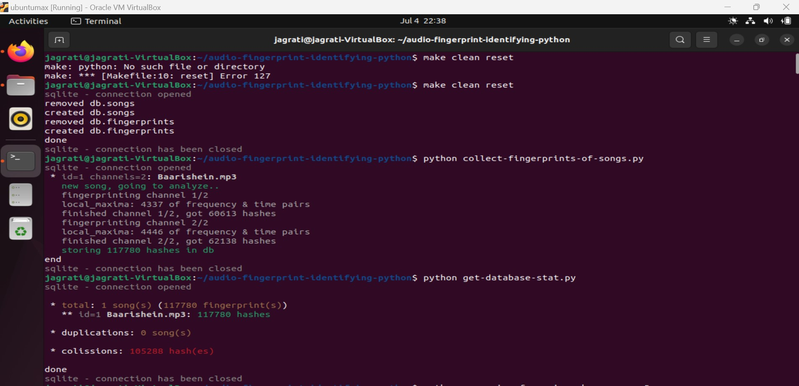
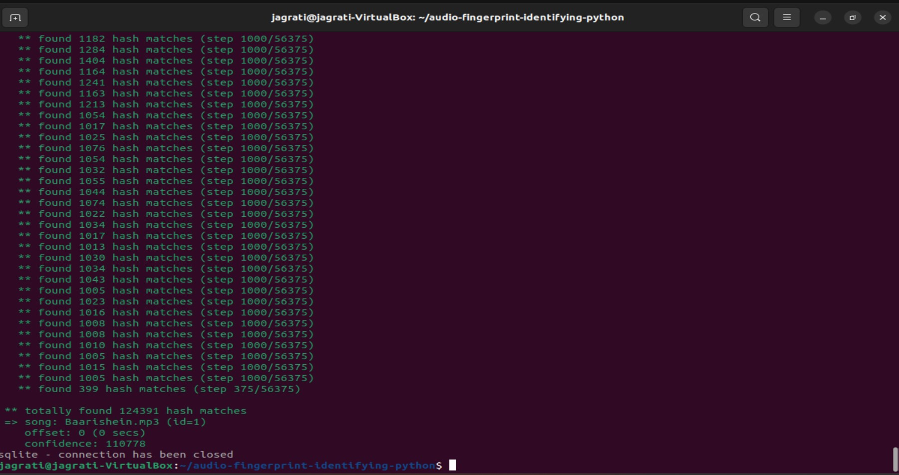

## TuneTag

TuneTag is an advanced Python application designed for accurate song identification using audio fingerprinting techniques and microphone input. Initially inspired by an open-source project, TuneTag has undergone extensive modifications to ensure compatibility with Python 3, streamlined code structures, and optimized performance. The application has been Dockerized for seamless deployment and scalability, specifically tailored for Linux environments.
Features
- Robust Song Identification: TuneTag employs sophisticated audio fingerprinting algorithms capable of accurately identifying up to 1000 distinct songs.
- Real-time Audio Processing: Utilizing microphone input, TuneTag swiftly analyzes audio snippets within 5 seconds, generating hash points for efficient song detection.

## Requirements

    Python 3.6 or higher
    Docker
    Linux (Ubuntu 20.04 LTS recommended)

## Installation
Docker Installation

Ensure Docker is installed on your Linux system. Refer to the official Docker documentation for installation instructions suitable for your distribution.
Building and Running TuneTag

  Clone the TuneTag repository:

    git clone https://github.com/your/repository.git
    cd repository

  Build the Docker image:
  
    docker build -t tunetag .

  Run TuneTag within a Docker container:

    docker run -it --rm tunetag

### Usage
- Launch TuneTag: Start the application within the Docker container.

- Microphone Input: Ensure your microphone is connected and accessible.

- Song Identification: Play a song or audio snippet near the microphone. TuneTag will process the audio in real-time and display the identified song within moments.

### Contribution

Contributions to TuneTag are welcome! To contribute:

    - Fork the repository.
    - Create a new branch (git checkout -b feature/your-feature).
    - Commit your changes (git commit -am 'Add new feature').
    - Push to the branch (git push origin feature/your-feature).
    - Create a new Pull Request.

### References
- [How does Shazam work](http://coding-geek.com/how-shazam-works/)
- [Audio fingerprinting and recognition in Python](https://github.com/worldveil/dejavu) - thanks for fingerprinting login via pynum
- [Audio Fingerprinting with Python and Numpy](http://willdrevo.com/fingerprinting-and-audio-recognition-with-python/)
- [Shazam It! Music Recognition Algorithms, Fingerprinting, and Processing](https://www.toptal.com/algorithms/shazam-it-music-processing-fingerprinting-and-recognition)
- [Creating Shazam in Java](http://royvanrijn.com/blog/2010/06/creating-shazam-in-java/)
- [Shazam Clone Method](https://github.com/itspoma/audio-fingerprint-identifying-python.git)

## License

TuneTag is licensed under the [MIT License](LICENSE).
